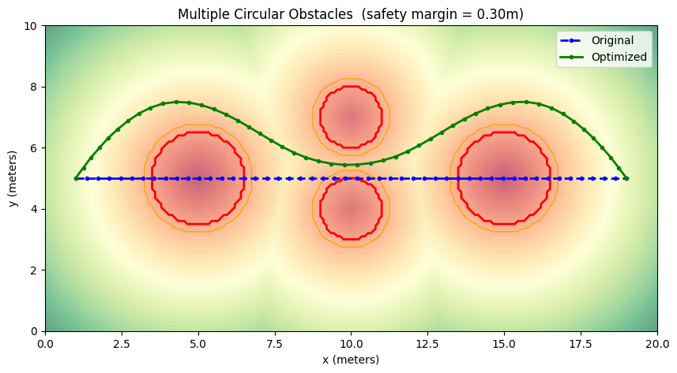

# lto-avoid

Optimization-based local trajectory adjustment for obstacle avoidance.

Occupancy grid → signed distance field → CasADi B-spline interpolant → IPOPT constrained NLP → collision-free trajectory.

## Installation

Requires Python 3.11+.

```bash
pip install git+https://github.com/jacobvm04/lto-avoid.git
```

Or for development:

```bash
git clone https://github.com/jacobvm04/lto-avoid.git
cd lto-avoid
uv sync --dev
```

## Quick start

```python
import numpy as np
from lto_avoid import make_empty_grid, add_circular_obstacle, compute_sdf, optimize_trajectory

grid = make_empty_grid(width=100, height=100, resolution=0.1)
grid = add_circular_obstacle(grid, cx=5.0, cy=5.0, radius=1.5)
sdf = compute_sdf(grid)

trajectory = np.linspace([1.0, 5.0], [9.0, 5.0], 30)  # any (N, 2) array of [x, y] waypoints
result = optimize_trajectory(trajectory, grid, sdf=sdf, safety_margin=0.3)
# result.trajectory is the optimized (N, 2) waypoint array
```

## Usage walkthrough

Start by building an occupancy grid. The grid is defined in cells — here we create a 20m x 10m world at 0.1m resolution, then place some circular obstacles:

```python
import numpy as np
from lto_avoid import (
    make_empty_grid,
    add_circular_obstacle,
    compute_sdf,
    optimize_trajectory,
)

grid = make_empty_grid(width=200, height=100, resolution=0.1)
grid = add_circular_obstacle(grid, cx=5.0, cy=5.0, radius=1.5)
grid = add_circular_obstacle(grid, cx=10.0, cy=4.0, radius=1.0)
grid = add_circular_obstacle(grid, cx=10.0, cy=7.0, radius=1.0)
grid = add_circular_obstacle(grid, cx=15.0, cy=5.0, radius=1.5)
```

`Grid` is immutable — each `add_*_obstacle` call returns a new grid. There's also `add_rectangular_obstacle(grid, x_min, y_min, x_max, y_max)` for axis-aligned boxes. All coordinates are in world meters.

Next, compute the signed distance field. This converts the binary occupancy grid into a smooth field where each cell stores its distance to the nearest obstacle boundary — positive in free space, negative inside obstacles:

```python
sdf = compute_sdf(grid)
```

Now provide a trajectory to optimize. This is just an `(N, 2)` numpy array of `[x, y]` waypoints — it can come from anywhere (a planner, manual waypoints, a recorded path, `np.linspace`, etc.):

```python
trajectory = np.linspace([1.0, 5.0], [19.0, 5.0], 50)
```

Finally, run the optimizer. It adjusts the waypoints to avoid obstacles while staying smooth and close to the original path. Obstacle avoidance is a hard constraint (`sdf(waypoint) >= safety_margin`), not a soft penalty:

```python
result = optimize_trajectory(
    trajectory, grid, sdf=sdf, safety_margin=0.3, w_smooth=1.0, w_deviation=0.3,
)
```

`result.trajectory` is an `(N, 2)` array of optimized waypoints in the same format as the input. `result.success` indicates whether IPOPT converged, and `result.solve_time_s` gives the wall-clock time.



The blue dashed line is the original straight-line trajectory passing through the obstacles. The green solid line is the optimized result — IPOPT finds a smooth, collision-free path while staying as close to the original as possible. The SDF heatmap shows obstacle distances, with red contours at the obstacle boundary and orange contours at the safety margin.

## Dependencies

- [NumPy](https://numpy.org/) >= 1.24
- [SciPy](https://scipy.org/) >= 1.11
- [CasADi](https://web.casadi.org/) >= 3.6
